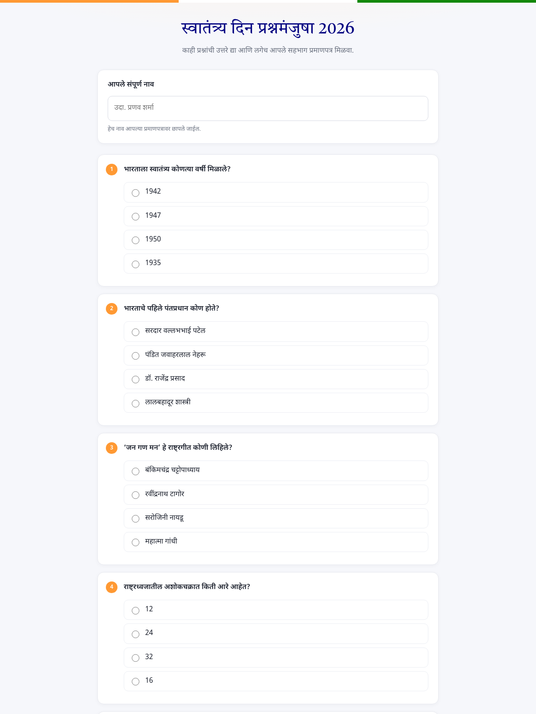
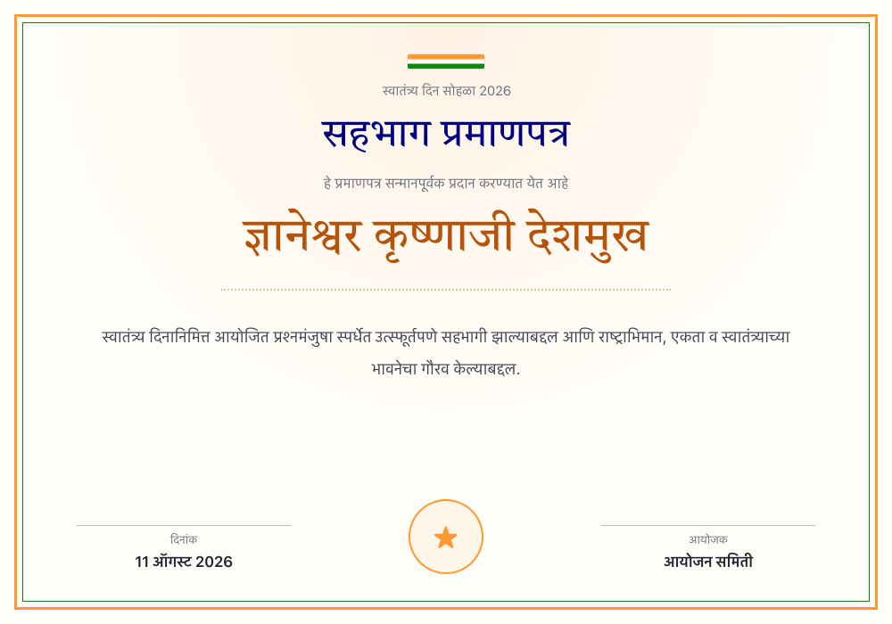

# स्वातंत्र्य दिन प्रश्नमंजुषा — Participation Certificate

A static Independence Day quiz page in Marathi. The participant enters their
name, answers a few questions, and a participation certificate with their name
is rendered instantly in the browser. They can download it as a PNG or take a
screenshot.

Everything runs client-side. No backend, no email, nothing is stored or sent
anywhere — the name never leaves the participant's browser.

| Quiz | Certificate |
| --- | --- |
|  |  |

## Files

| File | Purpose |
| --- | --- |
| `index.html` | Page structure (form + certificate) |
| `content.js` | **All text and questions — edit only this to change wording** |
| `styles.css` | Styling for the page and the certificate |
| `script.js` | Form handling, certificate rendering, PNG download |
| `preview-*.png` | Screenshots for this README only; safe to delete |

## Editing the quiz

Open `content.js`. `TEXT` holds every string on the page and the certificate;
`QUESTIONS` is an array of `{ q, options }`. Add, remove, or reword freely —
the page rebuilds itself from the array and the question numbering follows.

Answers are not checked and no score is shown; this is a participation
certificate only.

Numbers (years, counts, the date) use Latin digits while all words are in
Marathi. To switch the date to Devanagari numerals, change the locale in
`formatDate()` in `script.js` from `"mr-IN-u-nu-latn"` to `"mr-IN"`.

## Running locally

Because the page loads `content.js` and `script.js` as separate files, open it
through a local server rather than double-clicking the file:

```bash
python3 -m http.server 8000
```

Then visit http://localhost:8000

## Deploying to GitHub Pages

1. Commit and push these files to the repository root.
2. Repository → **Settings** → **Pages**.
3. Source: **Deploy from a branch**, branch `main`, folder `/ (root)`.
4. Save. The site goes live at `https://<username>.github.io/<repo>/` in about a
   minute.

There is no build step and nothing to install.

## Marathi rendering notes

Devanagari breaks in ways Latin text does not, so a few things are deliberate
and should be preserved when editing the CSS:

- **No `letter-spacing`** on any Devanagari text. It splits conjuncts and
  detaches matras from their base characters, both on screen and in the export.
- **No `text-transform`** — meaningless for Devanagari and it interferes with
  shaping in some engines.
- **Generous `line-height` (1.5+)**, otherwise matras above and below the line
  get clipped.
- **No `word-break: break-word`** on the name. Long names shrink to fit instead,
  since breaking mid-cluster produces broken glyphs.
- `font-synthesis: none` prevents faux-bold, which smears conjuncts.

The PNG export uses [html-to-image](https://github.com/bubkoo/html-to-image),
which renders through an SVG `foreignObject` so the browser's own text engine
shapes the Devanagari. This is why it is used instead of html2canvas, which
rasterises text character by character and mangles complex scripts.

## Optional: use local fonts

Fonts load from Google Fonts over CDN. If the venue's network is unreliable,
download `Tiro Devanagari Marathi` and `Noto Sans Devanagari` as `.woff2` into a
`fonts/` folder and declare them with `@font-face` instead. This also makes the
PNG export faster and more reliable.
